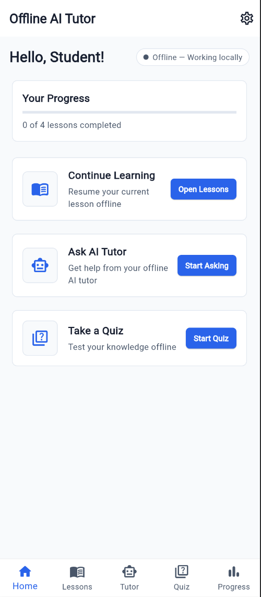
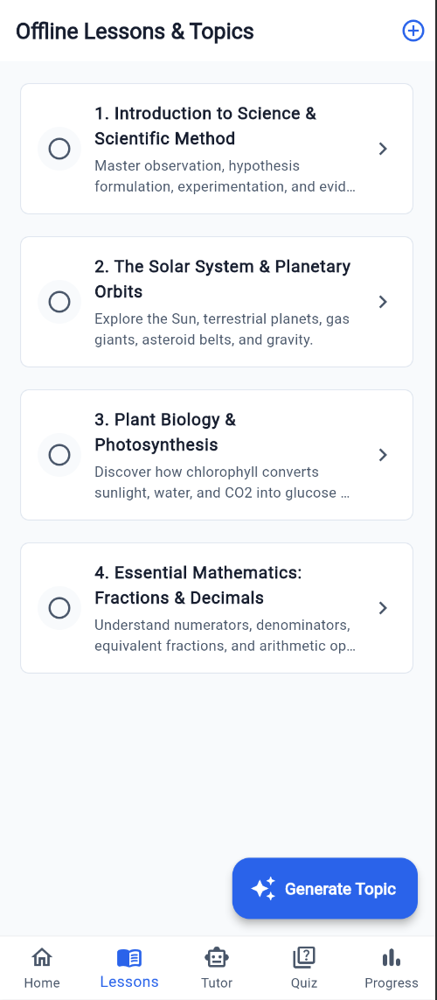
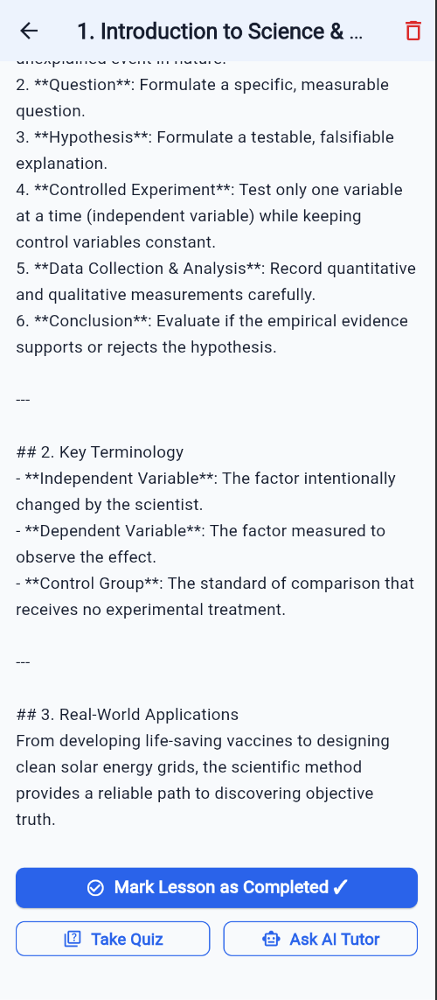
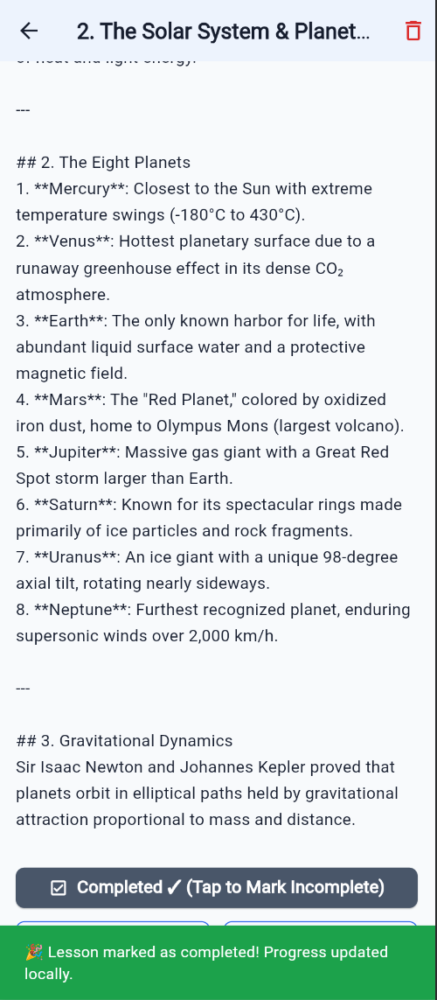
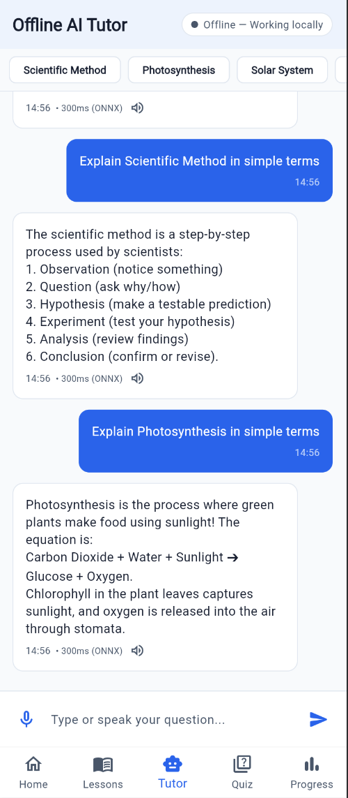
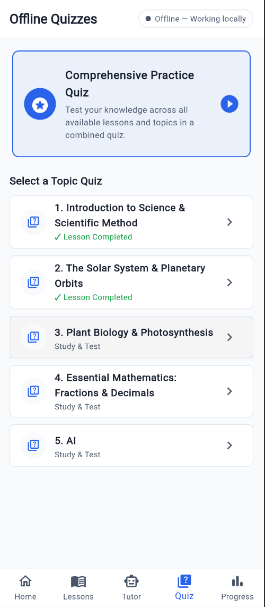
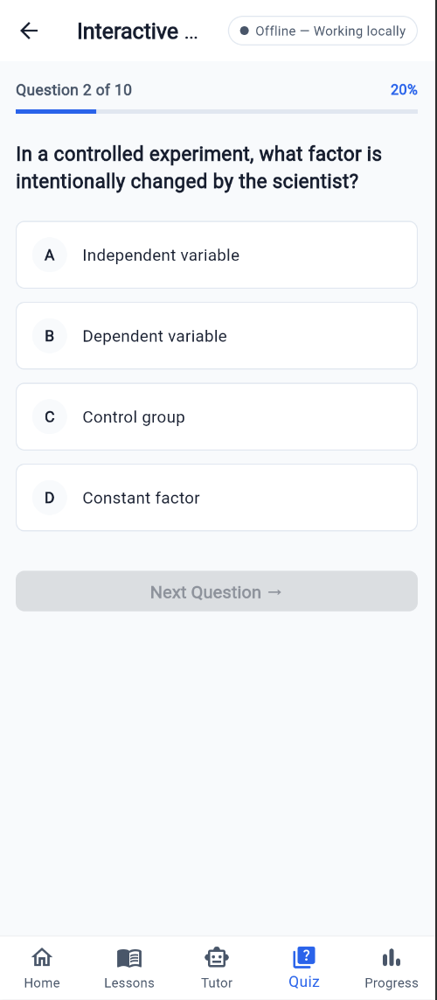
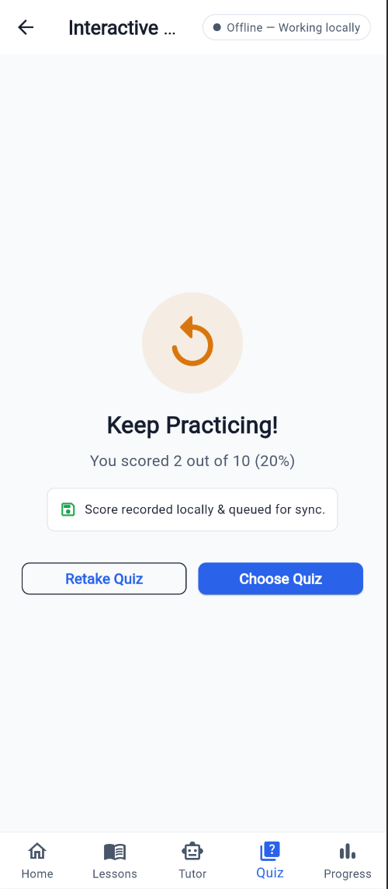
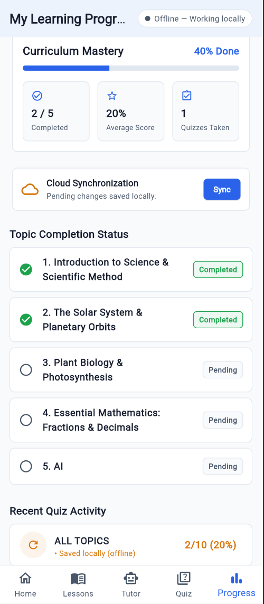
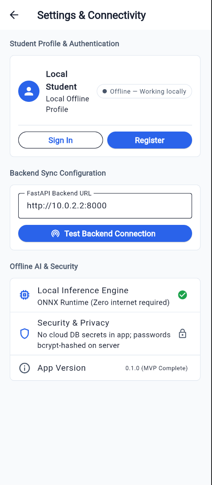

# Nabu

An offline-first educational platform designed to empower students in schools with limited or absent internet connectivity. The application runs local AI inference, stores student progress locally on-device, supports voice interaction, generates lesson content and practice quizzes offline, and synchronizes learning metrics seamlessly with the cloud whenever network connectivity is restored.

---

## 📌 Problem Statement

Many rural and underserved schools face significant infrastructure challenges, particularly unreliable or non-existent internet access. Traditional digital education tools and cloud-dependent AI tutoring services fail under these conditions, worsening the educational divide. 

**Offline AI Tutor** solves this problem by bringing AI-driven personalized instruction, interactive lessons, adaptive testing, and voice interaction directly to the student's mobile device without requiring active internet connectivity.

---

## 🎯 Key Objectives

- **Offline AI Inference**: Run lightweight machine learning models locally on low-cost Android hardware using ONNX Runtime with zero internet dependency.
- **On-Device Data Storage**: Use a robust local SQLite database as the single source of truth for student profiles, lessons, generated topics, practice quizzes, and scores.
- **Idempotent Synchronization**: Automatically detect network reachability, queue pending local changes, and synchronize data with a cloud backend without creating duplicate records or losing progress.
- **Dynamic Content & Quiz Generation**: Provide AI-assisted generation of comprehensive lesson chapters and multiple-choice practice quizzes offline.
- **Voice Interaction**: Support natural hands-free voice input via Speech-to-Text (STT) and voice responses via Text-to-Speech (TTS).

---

## 🛠️ Technology Stack

| Layer | Technology | Function |
|---|---|---|
| **Mobile Application** | Flutter (Dart) & Android SDK | Cross-platform mobile client built with clean architecture |
| **Offline AI Inference** | ONNX Runtime (`onnxruntime`) | On-device execution of lightweight local AI models |
| **Local Database** | SQLite (`sqflite`) | Persistent local data store for offline lessons, quizzes, and sync queue |
| **Voice Engine** | `speech_to_text` & `flutter_tts` | Hands-free audio input and vocalized AI responses |
| **Backend API** | Python (FastAPI + Pydantic) | REST API for student authentication, data sync, and remote persistence |
| **Cloud Database** | PostgreSQL / Supabase | Central database for synchronized student records and analytics |
| **Security** | `bcrypt` & JWT Tokens | Secure password hashing, token auth, and zero cloud secrets in client app |

---

## ✨ System Features

### 1. 🤖 Offline AI Tutor
- Ask subject questions using text or voice input.
- Receives answers generated locally by an on-device ONNX model with sub-second latency (~300ms).
- Text-to-Speech (TTS) engine reads AI explanations aloud for enhanced accessibility.
- Works continuously in airplane mode or remote locations with zero network requests.

### 2. 📚 Interactive Lessons & Topic Generator
- Access pre-loaded curriculum modules across Science, Astronomy, Biology, and Mathematics.
- Dynamic offline topic generator builds structured chapter content, key terminology, and real-world applications for any custom topic.
- Track completion states locally and resume studying at any time.

### 3. 📝 Offline Practice Quizzes & Automated Scoring
- Take multiple-choice quizzes designed to test topic comprehension.
- Real-time scoring system provides immediate feedback and performance breakdown.
- Quiz attempts, exact options selected, and timestamps are recorded in local SQLite database immediately.

### 4. 📊 Learning Analytics & Progress Dashboard
- Monitor curriculum completion percentages, average scores, and overall topic mastery.
- Clear visual indicators distinguish locally saved progress from cloud-synchronized data.

### 5. 🔄 Intelligent Cloud Synchronization
- Automatic network connectivity detection.
- Queues local learning records in an explicit state machine (`pending` → `syncing` → `synced`).
- Retries failed uploads gracefully upon network reconnection without removing local progress.
- Idempotent API handlers ensure duplicate sync requests do not create duplicate records on the server.

### 6. 🔒 Authentication & Security
- Supports local offline student profiles as well as cloud-linked student accounts.
- Password credentials are hashed using `bcrypt` on the server.
- Mobile client app contains no database credentials or privileged secrets.

---

## 📸 Application Screenshots

Below is a continuous walkthrough showcasing the primary features and screens of the application running live:

### 1. Student Dashboard & Home Screen

---

### 2. Offline Lessons & Topics Browser

---

### 3. Interactive Lesson Detail & Study View

---

### 4. Offline Progress Saving Notification

---

### 5. Offline AI Tutor Conversation & Voice Q&A

---

### 6. Offline Practice Quizzes Selection

---

### 7. Interactive Multiple-Choice Quiz Interface

---

### 8. Quiz Results & Local Sync Queue Recording

---

### 9. Learning Analytics & Cloud Sync Monitor

---

### 10. Settings, Authentication & Backend Connectivity

